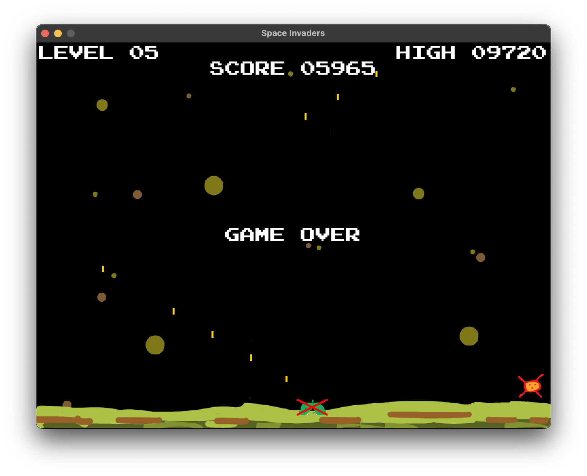

# space-invaders
Space Invaders in Go using an [Donburi ECS](https://github.com/yohamta/donburi/) and [Ebiten Graphics library](https://github.com/hajimehoshi/ebiten)

## Instructions
* Arrow keys to move left and right
* Space bar to fire
* Q to quit
* R to restart

## TODO
* ~~use https://github.com/yohamta/donburi/ to create a game~~
* ~~Define board size~~, borders, kill zone
* ~~Fire bullets~~
* ~~collision detection~~
  * ~~Destroy aliens~~
  * ~~Kill player~~
* ~~Swarm of aliens~~
* Destructible Barriers
* ~~Track scores~~
  * Write high scores to a file
* Different aliens
* Aliens shoot
* ~~Cool background~~
* ~~Levels with speed ups~~
* ~~Reset game~~
* 
* Stretch: Webassembly for Browser

## Images
### Player

### Alien

### Gameplay
Early development 

Recent development

### Game Over
